# 🎓 AI Learning Assistant

<div align="center">

### Transform PDFs into Interactive Learning Experiences

Upload study materials and instantly generate AI-powered summaries, flashcards, quizzes, concept explanations, and chat with an intelligent AI tutor.

Built with **React, Node.js, Express, MongoDB, and Google Gemini AI**.

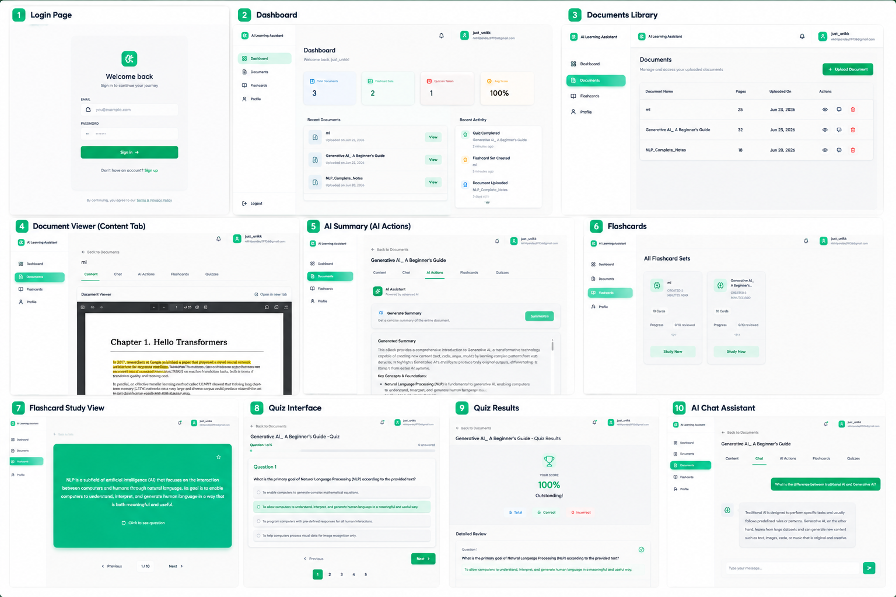

</div>

---

## 🌟 Overview

AI Learning Assistant is a full-stack AI-powered learning platform that helps students learn more effectively from their study materials.

Instead of spending hours reading lengthy PDFs, users can upload documents and instantly transform them into interactive learning resources.

### Generate Instantly

* 📖 AI-Powered Summaries
* 💡 Concept Explanations
* 💬 AI Study Assistant
* 🧠 Interactive Flashcards
* ❓ Practice Quizzes
* 📊 Learning Progress Tracking

The platform converts static documents into personalized learning experiences using modern AI capabilities.

---

# ✨ Features

## 🔐 Authentication & User Management

Secure authentication system built using JWT.

### Features

* User Registration
* User Login
* Protected Routes
* Session Persistence
* Profile Management

### Login Page

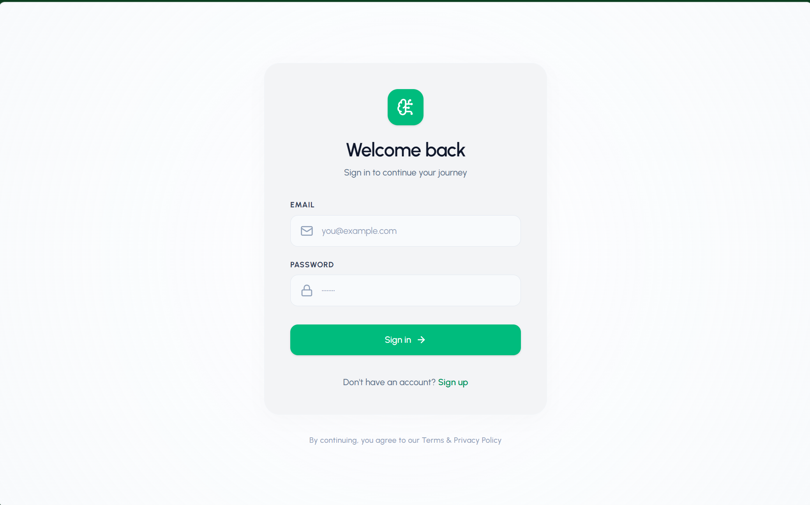

### Registration Page

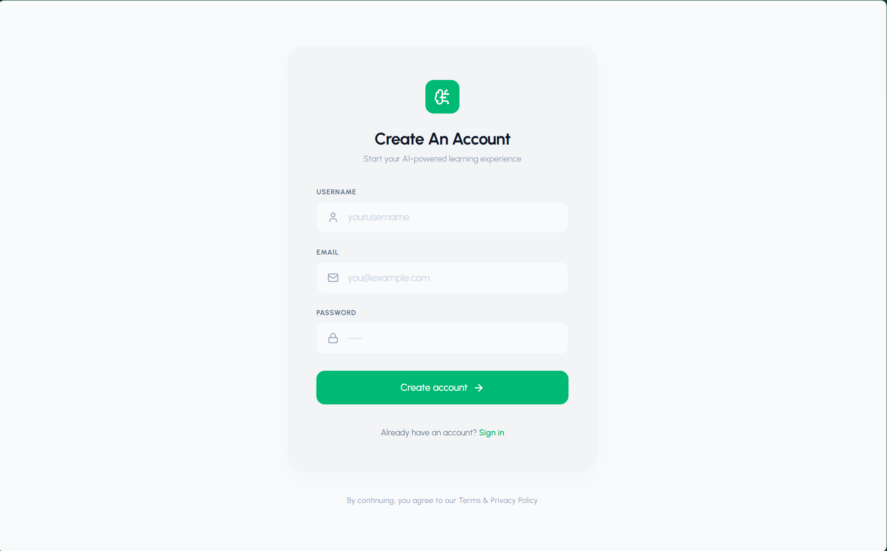

---

## 📄 Smart Document Management

Upload, organize, and access study materials from a centralized document library.

### Features

* PDF Upload
* Built-in PDF Viewer
* Document Library
* User-Specific Resources
* Secure File Handling

### Document Viewer

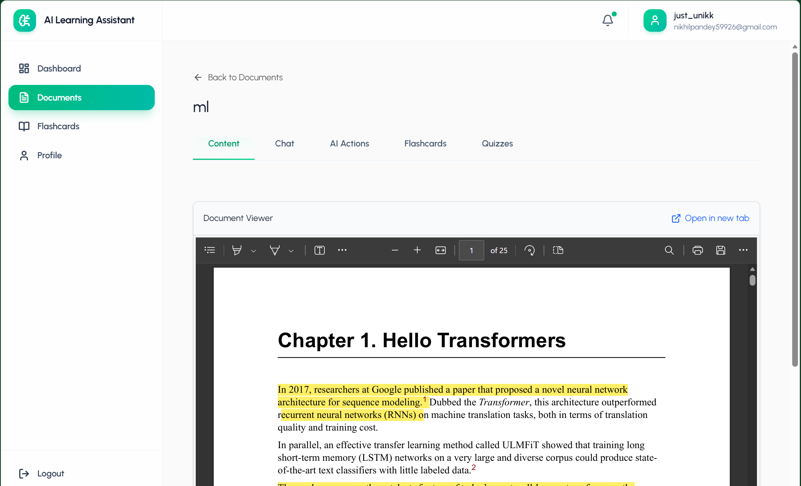

---

## 🤖 AI Learning Engine

Powered by Google Gemini AI, the platform automatically creates learning resources from uploaded study materials.

### AI Actions Dashboard

Generate summaries, explanations, flashcards, quizzes, and interact with the AI assistant.

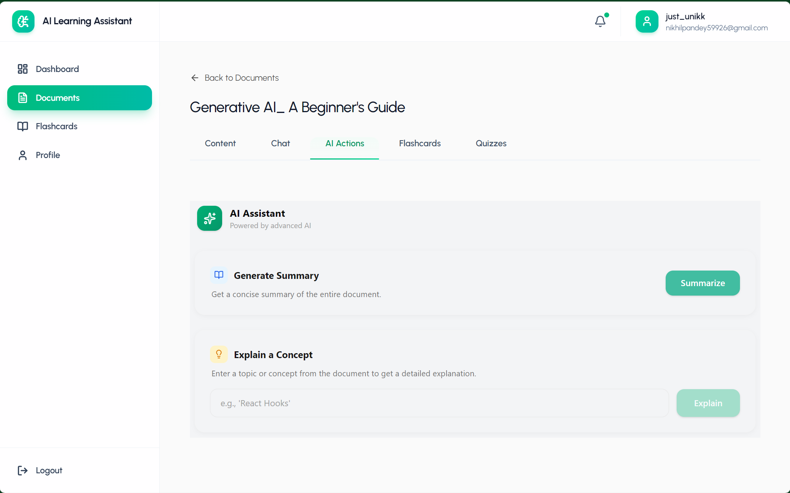

---

## 📖 AI Summary Generation

Convert lengthy study material into concise, easy-to-understand summaries.

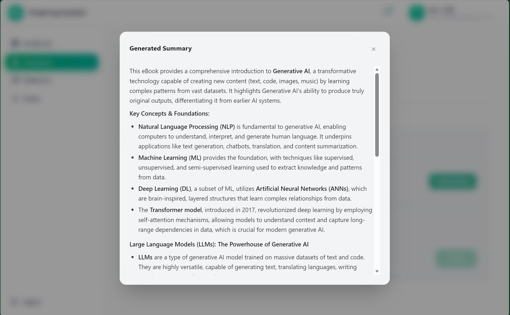

### Benefits

* Faster Revision
* Key Point Extraction
* Improved Understanding
* Reduced Reading Time

---

## 💡 Concept Explanation

Get detailed explanations for difficult concepts directly from your study material.

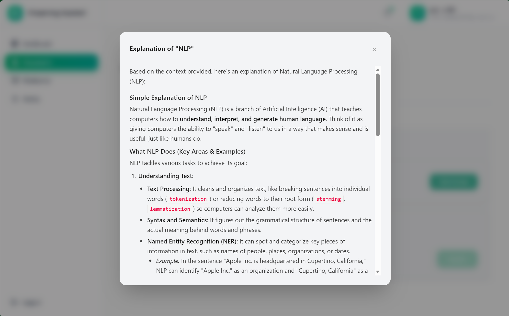

### Benefits

* Simplified Explanations
* Better Concept Clarity
* Topic Breakdown
* Personalized Learning

---

## 💬 AI Study Assistant

Chat with an AI tutor to ask questions, clarify doubts, and receive contextual explanations based on your learning material.

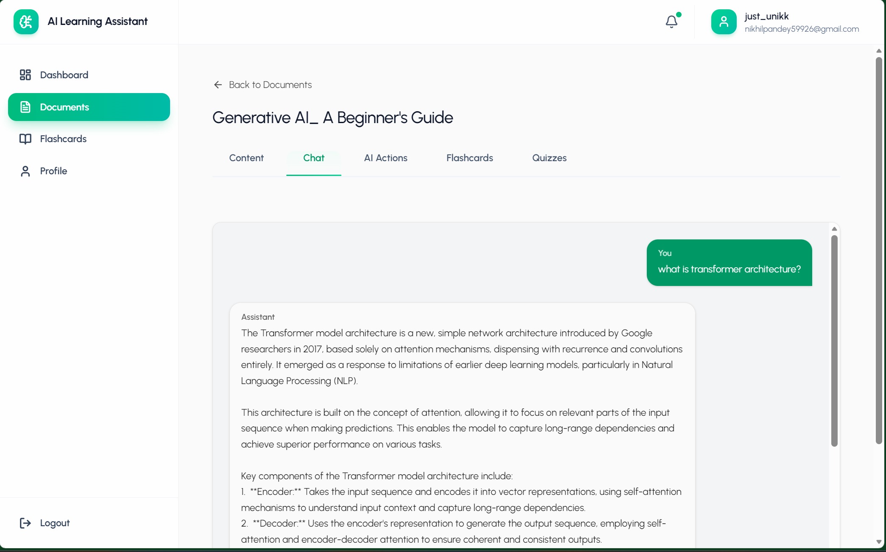

### Features

* Interactive Conversations
* Instant Doubt Resolution
* Context-Aware Responses
* Personalized Explanations
* AI-Powered Learning Support

---

## 🧠 Flashcard Learning System

Generate interactive flashcards automatically from uploaded content.

### Flashcard Collections

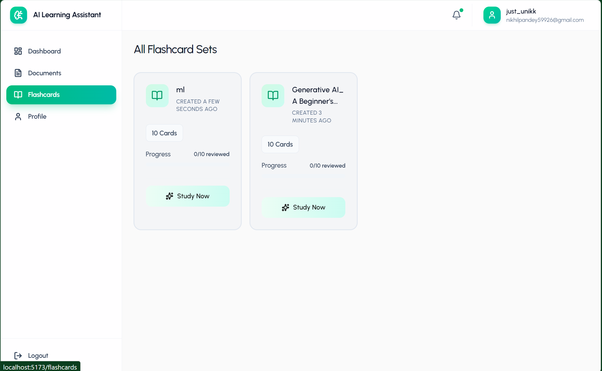

---

### Flashcard Study Mode

Practice active recall using AI-generated flashcards.

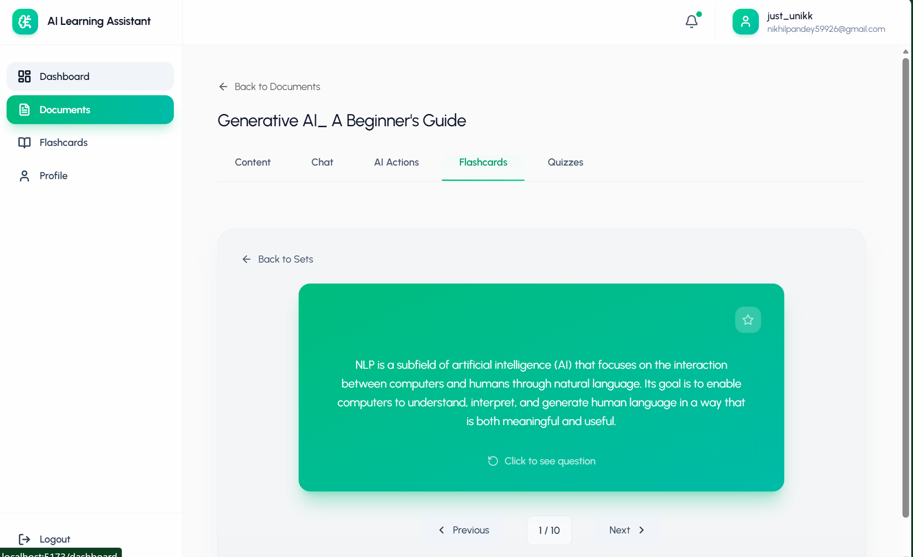

### Features

* Automatic Flashcard Generation
* Active Recall Learning
* Card Navigation
* Quick Revision Sessions
* Progress Tracking

---

## ❓ AI Quiz Generation

Automatically generate quizzes from uploaded study materials.

### Quiz Interface

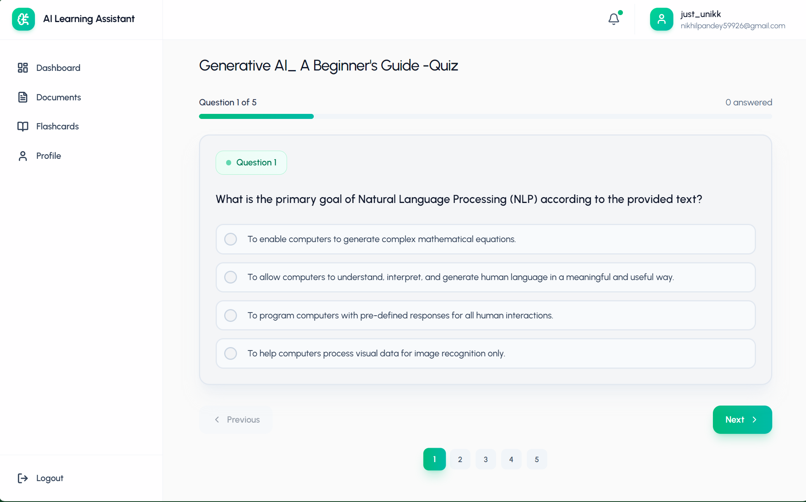

### Features

* AI-Generated Questions
* Multiple Choice Format
* Interactive Assessments
* Instant Evaluation

---

### Quiz Results & Performance Analysis

Analyze your performance with detailed answer reviews and scoring.

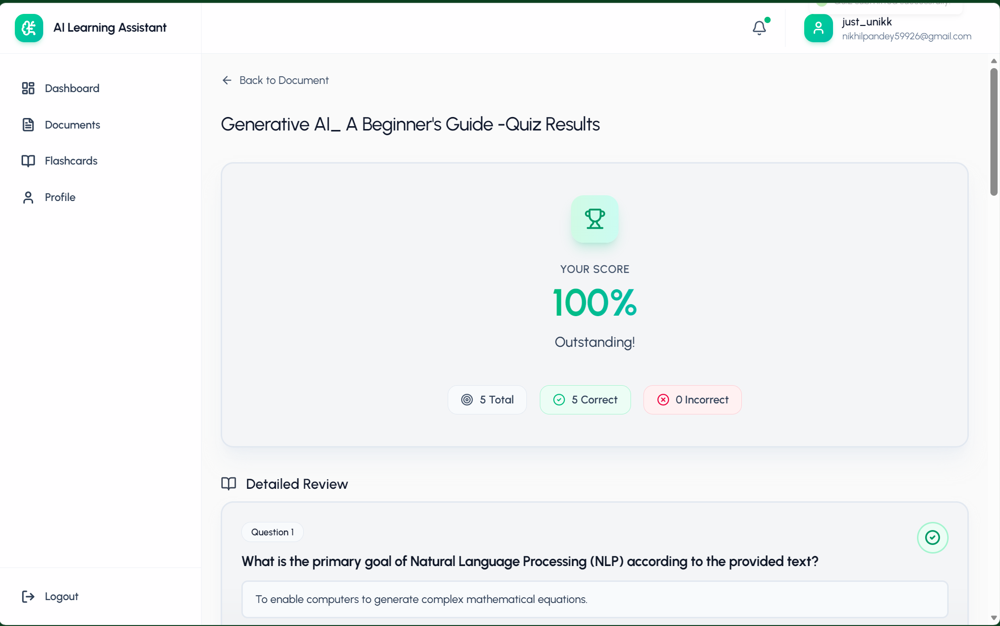

### Features

* Score Breakdown
* Answer Review
* Performance Tracking
* Learning Insights

---

# 🛠️ Tech Stack

## Frontend

* React.js
* Vite
* Tailwind CSS
* React Router
* Axios
* Context API

## Backend

* Node.js
* Express.js
* MongoDB
* Mongoose
* JWT Authentication
* Multer

## Artificial Intelligence

* Google Gemini API
* Prompt Engineering
* AI Content Generation

---

# 🏗️ System Architecture

```text
                    React Frontend
                           │
                           ▼
                    Express Backend
                           │
        ┌──────────────────┼──────────────────┐
        ▼                  ▼                  ▼
     MongoDB          Gemini API        File Storage
```

---

# 📂 Project Structure

```text
LMS/
│
├── backend/
│   ├── config/
│   ├── controllers/
│   ├── middleware/
│   ├── models/
│   ├── routes/
│   ├── utils/
│   ├── server.js
│   └── package.json
│
├── frontend/
│   └── ai-learning-assistant/
│       ├── src/
│       │   ├── components/
│       │   ├── pages/
│       │   ├── context/
│       │   ├── services/
│       │   └── utils/
│       └── package.json
│
├── uploads/
│
├── docs/
│   ├── app-preview-collage.png
│   └── screenshots/
│       ├── login-page.png
│       ├── register-page.png
│       ├── document-viewer.png
│       ├── ai-actions.png
│       ├── ai-summary.png
│       ├── ai-explanation.png
│       ├── ai-chat-assistant.png
│       ├── flashcard-sets.png
│       ├── flashcard-study.png
│       ├── quiz-interface.png
│       └── quiz-results.png
│
└── README.md
```

---

# ⚙️ Installation

## Clone Repository

```bash
git clone https://github.com/Abhishekkumarmnnit62/LMS.git
cd LMS
```

---

## Backend Setup

```bash
cd backend
npm install
```

Create a `.env` file:

```env
MONGO_URI=your_mongodb_connection_string
JWT_SECRET=your_jwt_secret
GOOGLE_API_KEY=your_google_api_key
PORT=5000
MAX_FILE_SIZE=10485760
```

Start the backend server:

```bash
npm run dev
```

---

## Frontend Setup

```bash
cd frontend/ai-learning-assistant
npm install
npm run dev
```

---

## 🌐 Local Development

| Service  | URL                   |
| -------- | --------------------- |
| Frontend | http://localhost:5173 |
| Backend  | http://localhost:5000 |

---

# 🎯 Key Highlights

* Full-Stack MERN Application
* Google Gemini Integration
* AI Study Assistant
* AI-Powered Learning Platform
* Intelligent PDF Learning Workflow
* AI Summary Generation
* Concept Explanation Engine
* Automatic Flashcard Generation
* AI Quiz Generation
* Secure JWT Authentication
* Responsive User Interface
* RESTful API Architecture

---

# 📚 What I Learned

This project helped me gain practical experience in:

* Full-Stack Web Development
* REST API Development
* Authentication & Authorization
* MongoDB Data Modeling
* AI Application Development
* Prompt Engineering
* File Upload & Processing Workflows
* Frontend State Management
* Error Handling & Validation
* Production-Oriented Application Architecture

---

# 🔮 Future Enhancements

* 🎙️ Voice-Based AI Tutor
* 🔊 Text-to-Speech Support
* 🔄 Learning Replay Mode
* 📈 Advanced Analytics Dashboard
* 📚 Multi-Document Learning Sessions
* 👥 Collaborative Learning Rooms
* 📱 Mobile Application
* ☁️ Cloud Storage Integration
* 🐳 Docker Deployment
* 🚀 CI/CD Pipeline

---

# 👨‍💻 Author

## NIKHIL KUMAR PANDEY

If you found this project useful, consider giving it a ⭐ on GitHub.

---

### ⭐ Learn Smarter. Revise Faster. Study with AI.
